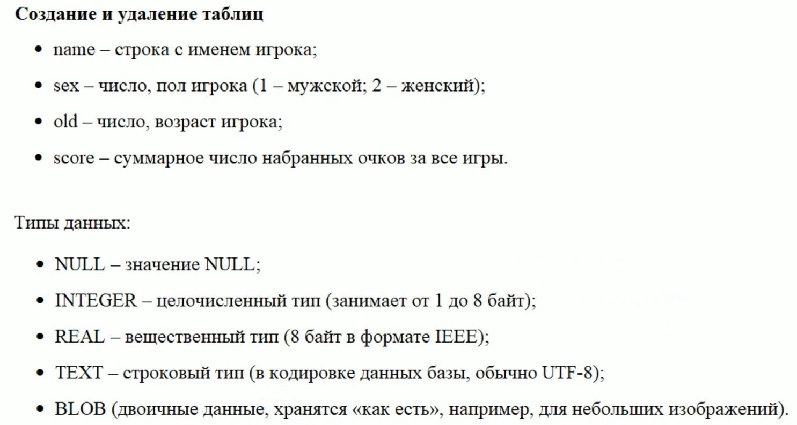
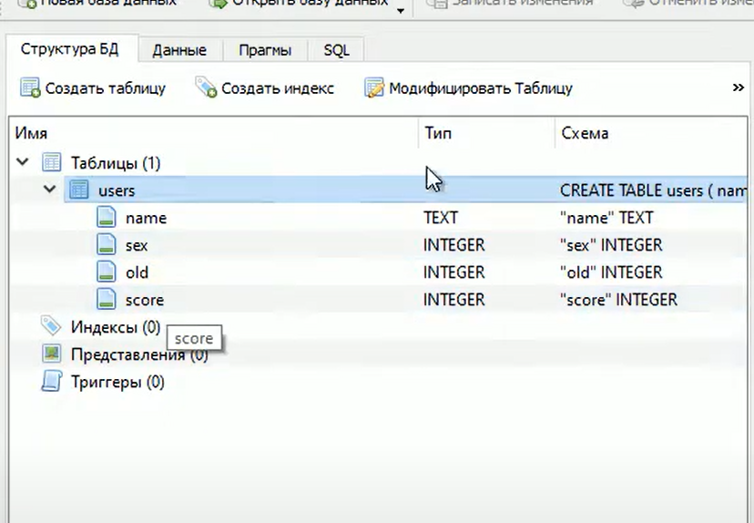

# python_SQLite
## Lesson 1: что такое СУБД и реляционные БД
При работе с обычным файлом, для хранения информации много сложностей,
которые нужно решить, например 
-   как обеспечить сохранность данных если
    в момент записи данных произойдет сбой или попросту не хватит места на 
    диске.
-   как продумать формат хранимых данных в файле.
- как прочитать отдельную запись в файле.
- как соединить данные из нескольких таблиц
- и многие, многие другие вопросы

Чтобы решать эти вопросы и были придуманы различные реляционные базы данных
и системы управления базами данных СУБД
Более детально все происходит так, после выбора определенной СУБД
программист получает доступ к ее API (Application Programming Interface) - программный интерфейс для взаимодействия с СУБД

Чтобы нам работать с API нужно определится с используемой СУБД
при программировании на python, популярными СУБД являются:
- PyWySQL
- Python SQLite (рассматриваем его)
- Python PostgreSQL

Модуль для работы с SQLite идет в стандартной библиотеке языка Python
в отличии, от многих других, ее устанавливать не нужно

SQLite это легковесная дисковая база данных, то есть эта СУБД без сетевого 
взаимодействия, разве что удаленное хранение этого файла.
Работает она по принципу "Один пишет - многие читают"
а также она развивается по принципу "Минимальный, но полный набор"
Идеально подходит для хранения данных различных приложений.
Все взаимодействие с этой СУБД происходит через, буквально несколько методов
главным из которых является 

`execute(SQL)` которому передается запрос SQL (Structured Query Language)
и как раз этот запрос (на языке SQL) указывает СУБД выполнить определенный
тип действия с данными
Все взаимодействие с БД происходит через этот язык SQL

Для упрощения работы с SQLite можно установить
DB Browser for SQLite
[link](https://sqlitebrowser.org)

## Lesson #2: подключение к БД, создание и удаление таблиц
`import sqlite3 as sq` - Импортируем модуль sqlite и даем ему синоним sq

Вызываем метод `connect` который устанавливает связь с базой данных "saper.db"
файл "saper.db" должен находится в том же каталоге, что и исполняемый файл
Если этот файл уже существует, то связь установится, а если файла не существует, то
он будет создан.
После того как мы поработаем с базой данных, файл соединжения нужно закрыть 
Для этого вызывается метод `close` у объекта который содержит это соединенье
вначале создадим такой объект с названием "con" (connect)

`con = sq.connect("saper.db"")`

Далее нам нужен объект cursor (курсор) для его создания используется метод `cursor`
который возвратит экземпляр класса Cursor и уже через этот вернувшийся объект
мы осуществляем непосредственную работу с базой данных

`cur = con.cursor()`

В самом простом случае можем вызвать метод "execute" которому в качестве аргумента
передается SQL запрос для работы с базой данных

`cur.execute("""
""")`    В данном случае мы ничего не сделаем, но метод вызовется и ничего не сделает, так тоже можно и ошибок не будет
И мы увидим в нашем проекте файл saper.db

И закрываем обязательно соединение
`con.close()`

```python
import sqlite3 as sq

con = sq.connect("saper.db")
cur = con.cursor()
cur.execute("""
""")
con.close()
```
В качестве расширения у файла базы данных может быть:

*.db, *.db3, *.sqlite, *.sqlite3
можно написать и произвольное расширение, но принято использовать эти

Сразу можно отметить, что использование в таком виде соединения это
не самый лучший вариант. Дело в том что, есть такой момент, если
в процессе работы до закрытия соединения, произойдет ошибка, то не будет
вызван метод close() это очень плохо, мы можем потерять данные.

Поэтому лучше всего открывать соединение с базой данных
через контекстный менеджер with языка python

```python
import sqlite3 as sq

with sq.connect("saper.db") as con:
    cur = con.cursor()

    cur.execute("""

    )""")
```
Контекстный менеджер сам закрывает соединение с базой данных, даже если
произойдет ошибка. Такая конструкция гораздо удобней и безопасней в использовании
Теперь для примера создадим такую базу данных
Таблица будет называться users и будет иметь поля
 - name - строка с именем игрока;
 - sex - число, пол игрока (1-мужской; 2-женский);
 - old - число, возраст игрока;
 - score - суммарное число набранных очков за все игры.

И еще нам нужно знать типы данных которые мы можем использовать,
вот их полный список для SQLite:

 - NULL - значение NULL;
 - INTEGER - целочисленный тип (занимает от 1 до 8 байт);
 - REAL - вещественный тип (8 байт в формате IEEE)
 - TEXT - строковый тип (в кодировке данных базы, обычно UTF-8)
 - BLOB (двоичные данные, хранятся "как есть", например, для изображений)

IEEE 754 (IEC 60559) — широко используемый стандарт IEEE, описывающий формат 
представления чисел с плавающей точкой. Используется в программных 
(компиляторы разных языков программирования) и аппаратных (CPU и FPU) 
реализациях арифметических действий (математических операций).




Теперь создадим описанную выше базу данных:

```python
import sqlite3 as sq

with sq.connect("saper.db") as con:
    cur = con.cursor()

    cur.execute("""CREATE TABLE user (
    name TEXT,
    sex INTEGER,
    old INTEGER,
    score INTEGER
    )""")
```

И вот после выполнения кода мы увидим в нашей базе данных такую структуру



