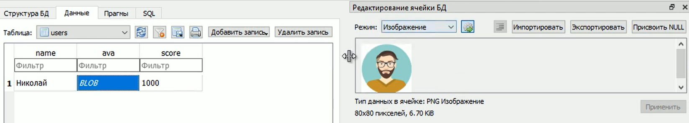

### Lesson #10: методы fetchall, fetchmany, fetchone, Binary, iterdump
Тут продолжим изучение API для работы с SQLite на языке Python

Изучим способы извлечения данных из запросов, об этом говорили в lesson_3.md
как напоминание картинка с методами для извлечения данных:


Для начала наполним нашу базу данных о машинах (cars) данными
```python
import sqlite3 as sq

cars = [
    ('Audi', 52642),
    ('Mercedes', 57127),
    ('Skoda', 9000),
    ('Volvo', 29000),
    ('Bentley', 350000),
]

with sq.connect("cars.db") as con:
    cur = con.cursor()

    cur.execute("""CREATE TABLE IF NOT EXISTS cars(
                    car_id INTEGER PRIMARY KEY AUTOINCREMENT,
                    model TEXT,
                    price INTEGER
    )""")
    
    cur.executemany("INSERT INTO cars VALUES(NULL, ?, ?)", cars)
    cur.execute("SELECT model, price FROM cars")
```
Делаем все тоже что делали на предыдущем уроке, заполняем базу данных данными (создав ее предварительно)
из списка cars
Видим такие данные в таблице.


Теперь с помощью SQL проведем выборку всех значений в таблице

```python
# продолжение
     cur.execute("SELECT model, price FROM cars")
```
Воспользуемся методом fatchall()
```python
import sqlite3 as sq

with sq.connect("cars.db") as con:
    cur = con.cursor()
    
    cur.execute("SELECT model, price FROM cars")
    rows = cur.fetchall()
    print(rows)
```
Тут выведутся все записи которые нам вернет запрос `"SELECT model, price FROM cars"`

Увидим следующее


По аналогии работает и метод fetchone() только он выдаст первую запись из выборки
и обязательно перед каждым использованием этих методов совершать сам SQL запрос
иначе будет None
```python
import sqlite3 as sq


with sq.connect("cars.db") as con:
    cur = con.cursor()
    
    cur.execute("SELECT model, price FROM cars")
    rows = cur.fetchone()
    print(rows)
```
Увидим следующее


Еще есть метод fatchmany(4) он вернет списком первые записи в количестве которое мы укажем
в аргументе, в данном случае четыре. По умолчанию вернет в списке один первый элемент.
```python
import sqlite3 as sq

with sq.connect("cars.db") as con:
    cur = con.cursor()
    
    cur.execute("SELECT model, price FROM cars")
    rows = cur.fetchmany()
    print(rows)
```
Увидим следующее


Мы говорили, что, после формирования выборки, сам экземпляр класса Cursor
(у нас это экземпляр с именем (cur)) можно использовать как итерируемый объект.
То есть его можно перебрать в цикле, пройдясь по всем элементам.

```python
import sqlite3 as sq

with sq.connect("cars.db") as con:
    cur = con.cursor()

    cur.execute("SELECT model, price FROM cars")
    
    for result in cur:
        print(result)

```
Увидим следующее


Преимущество такого метода работы в экономии памяти. Тут на каждой итерации мы берем
только одно значение, и только его храним в памяти. Это часто бывает очень эффективно

Теперь посмотри, у нас все выходные данные это картежи (tuple).
Но иногда это не удобно, иногда удобнее использовать словарь (dict)
Для получения данных в виде словаря можно поступить так. В самом начале 
при подключении к базе данных, нужно указать свойству row_factory класса Connect
значение равное sq.Row

```python
import sqlite3 as sq

with sq.connect("cars.db") as con:
    con.row_factory = sq.Row
    cur = con.cursor()

    cur.execute("SELECT model, price FROM cars")
    
    for result in cur:
        print(result)

```
Этот объект (sq.Row) как раз и содержит данные в виде словаря (ключ: значение)


Соответственно вместо простого print() нужно обращаться соответственно,
ключами будут выступать названия полей в нашем запросе.

```python
import sqlite3 as sq

with sq.connect("cars.db") as con:
    con.row_factory = sq.Row
    cur = con.cursor()

    cur.execute("SELECT model, price FROM cars")
    
    for result in cur:
        print(result['model'], result['price'])

```

Увидим следующее

Так работать во многих ситуациях будет правильнее.

Теперь поговорим о способе хранения изображений в базе данных.
Это часто требуется если у нас есть аватарки у каждого пользователя в системе.
Естественно этот аватар представляет собой изображение 

Посмотрим как нам можно описать базу данных для хранения таких данных.
Создадим в самом начале программы таблицу, которая будет содержать поле (ava).
У него будет тип данных (BLOB), это как раз тип данных, который представляет данные в 
бинарном виде, то есть они ни как не преобразовываются (записываются как есть)

Теперь посмотрим, как можно записать в базу изображения, и затем прочитать изображения.

Создадим функцию read_ava()
Она будет читать изображения, принимать будет (n) - номер аватарки,
а аватарки хранятся в виде (avas/{n}.png) (то есть в папке avas в которой по номерам 1... и т.д.)
Беря из папки файл соответствующий номеру, открываем его на бинарное чтение
и читаем с помощью функции read() и возвращает эти прочитанные бинарные данные.
А если возникла ошибка, то ее выводим на экран ошибку, и функция возвращает False

Далее мы делаем преобразование `binary = sq.Binary(img)` с помощью специального метода 
sq.Binary() преобразовываем бинарные данные в специальный бинарный объект модуля SQLite
И затем уже только такой специальный объект мы сможем записать в базу данных.

```python
import sqlite3 as sq


def read_ava(n):
    try:
        with open(f"avas/{n}.png", "rb") as f:
            return f.read()
    except IOError as e:
        print(e)
        return False

            
with sq.connect("cars.db") as con:
    con.row_factory = sq.Row
    cur = con.cursor()

    cur.execute("""CREATE TABLE IF NOT EXISTS users(
                    name TEXT,
                    ava BLOB,
                    score INTEGER
    )""")
    
    img = read_ava(1)
    if img:
        binary = sq.Binary(img)
        cur.execute("INSERT INTO users VALUES('Николай', ?, 1000)", (binary,))

```

После выполнения кода увидим, таблицу users, в которой такие данные 


Теперь, напишем код который, будет читать это изображение из таблицы users
В начале сделаем такой запрос `SELECT ava FROM users LIMIT 1`
то есть прочитаем одну запись 
и прочитаем бинарные данные, `img = cur.fetchone()['ava']` в переменную img
И теперь что бы мы могли воспользоваться этими данными, создадим функцию (write_ava()), которая
будет записывать эти данные в виде графического файла. Передаем функции name - имя файла, в который запишем данные,
data - это сами наши данные.
Затем, открываем файл на запись в бинарном режиме, и записываем туда данные. Если запись
прошла успешно, функция возвращает True


```python
import sqlite3 as sq


def write_ava(name, data):
    try:
        with open(name, "wb") as f:
            return f.write(data)
    except IOError as e:
        print(e)
        return False
    finally:
        return True
            

with sq.connect("cars.db") as con:
    con.row_factory = sq.Row
    cur = con.cursor()

    cur.execute("""CREATE TABLE IF NOT EXISTS users(
                    name TEXT,
                    ava BLOB,
                    score INTEGER)
    """)
    cur.execute("SELECT ava FROM users LIMIT 1")
    
    img = cur.fetchone()['ava']
    write_ava("out.png", img)

```

После запуска кода увидим сформированный файл (out.png), с аватаркой которая у нас 
 была загружена, шагом ранее в базу данных.
То есть чтение данных прошло успешно.

Таким образом можно делать чтение и запись данных в базе данных.

Несколько слов о полезном методе iterdump() класса Cursor. Метод возвращает итератор,
для SQL запросов, на основе которых можно воссоздавать "секущую" базу данных.
Посмотрим как это можно использовать, если подключится к нашей базе (cars), и
воспользоваться методом iterdump()

```python
import sqlite3 as sq

with sq.connect("cars.db") as con:
    # cur = con.cursor()
    for sql in con.iterdump():
        print(sql)

```
Так мы можем получить список sql запросов для формирования таблиц этой базы данных
Выполнив такой код увидим в консоли следующее

Мы видим всю последовательность того как мы создавали нашу базу данных.

Для большей функциональности программы мы сохраним все эти строки в отдельном файле.

```python
import sqlite3 as sq

with sq.connect("cars.db") as con:
    cur = con.cursor()
    with open("sql_damp.sql", "w") as f:
        for sql in con.iterdump():
            f.write(sql)

```

Теперь имея такой файл, мы сможем восстановить нашу базу данных к такому состоянию как она 
сейчас существует, научимся это делать.
Читаем наш файл созданный ранее содержимое его в sql переменную и выполняем как скрипт
SQL открыв соединение с базой данных (cars)

```python
import sqlite3 as sq

with sq.connect("cars.db") as con:
    cur = con.cursor()
    with open("sql_damp.sql", "r") as f:
        sql = f.read()
        cur.executescript(sql)

```

По итогу у нас воссоздастся наша база данных.

Еще одна особенность модуля SQLite является возможность создания базы данных
непосредственно в оперативной памяти. Такая организация позволяет хранить временные 
данные программы в формате таблиц, и работать с ними через SQL запросы.
Для создания такой базы в оперативной памяти устройства нужно подключаться к ней
следующим образом
`con = sq.connect(':memory:')` после такого подключения база будет создана в оперативной 
памяти устройства. После чего можно с ней работать точно также как ранее.

```python
import sqlite3 as sq
con = sq.connect(':memory:')

```
