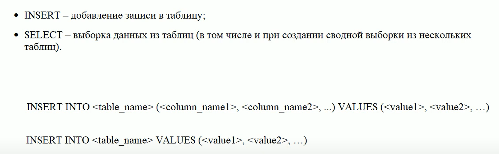
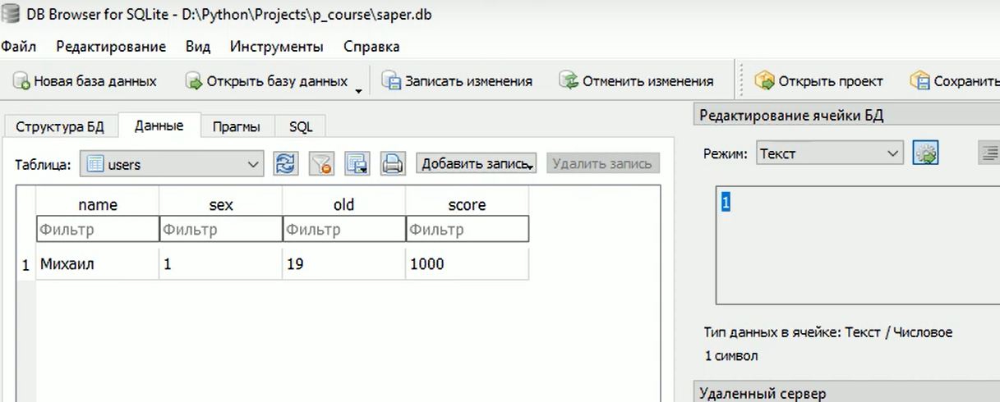
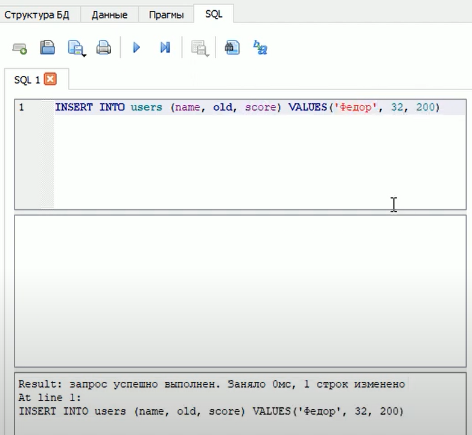
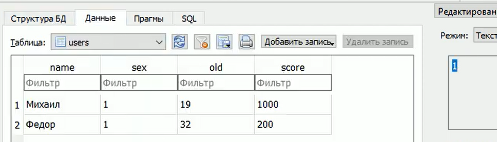

### Lesson №3: команды SELECT и INSERT при работе с таблицами БД и запросы для выборки данных

Для этого используетя 2-е команды:
 - INSERT - добавление записи в таблицу;
 - SELECT - выборка данных из таблиц (в том числе и при создании сводной выборки из нескольких таблиц)

Начнем с INSERT. Посмотрим на ее синтаксис:
INSERT INTO<table_name>(<column_name1>,<column_name2>, ...) VALUES(<value1>,<value2>, ...)

Где:
 - table_name - имя таблицы в которую вставляются данные
 - column_name - поля этой таблицы в которые будем вставлять данные
 - value - сами данные, которые запишутся в соответствующие поля таблицы
 
Можно еще не указывать поля таблицы, тогда будут значения записываться "просто по порядку" как в базе данных
идут поля

INSERT INTO<table_name> VALUES(<value1>,<value2>, ...)



Теперь посмотрим как идут такие запросы через SQL 

```SQL
INSERT INTO user VALUE ('Михаил', 1, 19, 1000)
```
Пропишем этот SQL запрос в базе данных и посмотрим что происходит


И теперь видим данные которые мы добавили 


И повторим с таким SQL кодом

```SQL
INSERT INTO user (name, old, score) VALUE ('Федор', 32, 200)
```
То-есть тут мы поле sex пропускаем, оно у нас по умолчанию должно записаться 1 (благодаря DEFAULT 1)


И теперь видим еще одни данные которые мы добавили 


