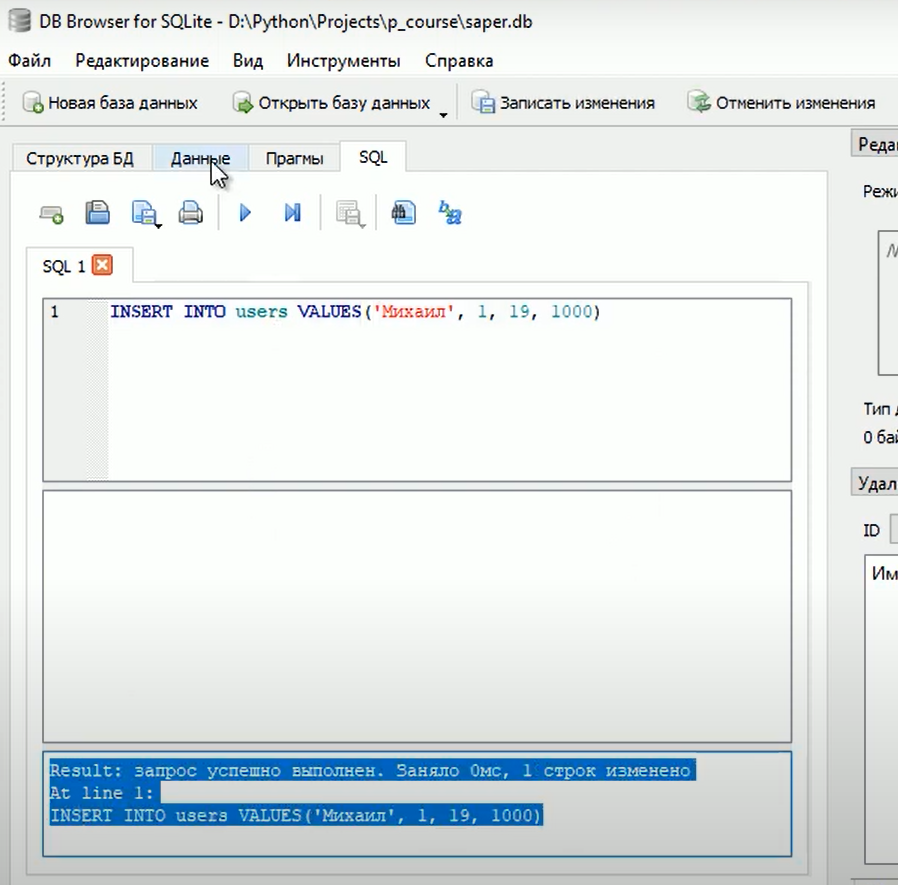

### Lesson №3: команды SELECT и INSERT при работе с таблицами БД и запросы для выборки данных

Для этого используется 2-е команды:
 - INSERT - добавление записи в таблицу;
 - SELECT - выборка данных из таблиц (в том числе и при создании сводной выборки из нескольких таблиц)


#### Начнем с INSERT. Посмотрим на ее синтаксис:
INSERT INTO<table_name>(<column_name1>,<column_name2>, ...) VALUES(<value1>,<value2>, ...)

Где:
 - table_name - имя таблицы в которую вставляются данные
 - column_name - поля этой таблицы в которые будем вставлять данные
 - value - сами данные, которые запишутся в соответствующие поля таблицы
 
Можно еще не указывать поля таблицы, тогда будут значения записываться "просто по порядку" как в базе данных
идут поля

INSERT INTO<table_name> VALUES(<value1>,<value2>, ...)


Теперь посмотрим как идут такие запросы через SQL 

```SQL
INSERT INTO user VALUES ('Михаил', 1, 19, 1000)
```
При таком методе мы обязаны передать все поля таблицы.
Пропишем этот SQL запрос в базе данных и посмотрим что происходит


И теперь видим данные которые мы добавили 


И повторим с таким SQL кодом

```SQL
INSERT INTO user (name, old, score) VALUES ('Федор', 32, 200)
```
То-есть тут мы поле sex пропускаем, оно у нас по умолчанию должно записаться 1 (благодаря DEFAULT 1)
Если мы хотим пользоваться авто-подстановками, дефолтными значениями, то необходим такой метод добавления 
данных в таблицы


И теперь видим еще одни данные которые мы добавили 


Если хотим несколько команд сразу выполнить, необходимо писать так:

```SQL
-- Коментарий
INSERT INTO user (name, sex, old, score) VALUES ('masha', 2, 25, 200);
INSERT INTO user (name, sex, old, score) VALUES ('Olia', 2, 30, 200);
INSERT INTO user (name, sex, old, score) VALUES ('Ksuxa', 2, 22, 200);
```

#### Теперь посмотрим команду SELECT ее синтаксис

в самом простом виде:
SELECT col1, col2, ... FROM <table_name>

Это одна из самых часто используемых команд в SQL
Она позволяет делать выборку данных из таблиц

 - col1, col2 - это поля таблицы которые мы выбираем
 - table_name - это таблицы из которой мы делаем выборку

Например, мы можем сделать так:

```SQL
SELECT name, old, score FROM user
```


Если нам нужны все поля в выборке, то:
но лучше * не использовать, а всегда перечислять 
поля... если нужны все поля и перечислить все поля
```SQL
SELECT * score FROM user
```


Но обычно команду SELECT используют совместно с ключевым словом WHERE
синтаксис такой:

SELECT col1, col2, ... FROM <table_name> WHERE <условие>

WHERE определяет условие выборки тех или иных записей

Например, выберем всех игроков у которых число очков меньше 1000
```SQL
SELECT * FROM user WHERE score >= 1000
```


Отдельный вопрос, где хранит файлы программа DBeaver:

C:\Users\auram\AppData
\Local\Packages\DBeaverCorp.DBeaverCE_1b7tdvn0p0f9y
\LocalCache\Roaming\DBeaverData\workspace6\General\Scripts

В качестве сравнений в SQL можно использовать:

 - Равно (=) или (==) проверка на равенство
 - Больше, больше или равно это (>)(>=)
 - Меньше, меньше или равно это (<)(<=)
 - Не равно это (!=)
 - между это BETWEEN

Например, выберем все записи у которых количество очков лежит в 
интервале от 500 до 1000

```SQL
SELECT * FROM user WHERE score BETWEEN 500 AND 1000
```

На практике часто требуется использовать в условии (фильтре) 
учитывать значения несколько столбцов
Например мы хотим выбрать игроков, 
старше 20-и лет и с числом очков больше 300

Тут уже нужно использовать составное условие, для этого используют другие 
ключевые слова:

 - NOT условное НЕ
 - AND это условное И
 - OR условное ИЛИ

 - IN проверка вхождения во множество значений
 - NOT IN - проверка невхождения во множество

Приоритет у этих условий именно как тут указан самый высокий у NOT


```SQL
SELECT * FROM user WHERE score < 1000 AND old > 20
```


Так же в выборке можно выполнять сортировку при помощи ORDER BY
```SQL
SELECT * FROM user 
WHERE old IN (19, 32) AND score <= 1000 OR sex = 1
ORDER BY old
```
```SQL
SELECT * FROM user 
WHERE old IN (19, 32) AND score <= 1000 OR sex = 1
ORDER BY old ASC 
```
Тут сортировка выполнится по полю old (возраст) в порядке возрастания возраста
используется по умолчанию ASC (можно не указывать ключевое слово)
Если нам нужно в порядке убывания то применяют DESC

```SQL
SELECT * FROM user 
WHERE old IN (19, 32) AND score <= 1000 OR sex = 1
ORDER BY old DESC 
```


Последнее, что мы тут рассмотрим это оператор LIMIT
Который говорит сколько записей мы будем отбирать из нашей выборки 
То-есть ограничение количества выводимых строк из всей выборки

Cинтаксис LIMIT
LIMITED <max> [OFFSET ofset]

 - max это число записей которые мы хотим видеть в нашей выборке
 - OFFSET ofset (OFFSET ключевое слово)(offset число записей которые мы пропустим вначале)

Или записывают еще так:
LIMIT <offset, max>

```SQL
SELECT * FROM user 
WHERE old IN (19, 32) AND score <= 1000 OR sex = 1
ORDER BY old ASC
LIMIT 2
```

Видим вместо 3-х только 2-е строчки 


Для примера выберем всех игроков у которых более 100 очков отсортируем их
по количеству очков и разное количество записей выведем

Тут просто 5 первых записей


Тут тоже пять записей, но пропустив 2-е первые записи


И то же самое, но другим синтаксисом


```SQL
SELECT * FROM user 
WHERE score > 100 
ORDER BY score DESC 
LIMIT 2, 5
```

Ну и конечно же все это можно делать на языке Python:

```Python
import sqlite3 as sq

with sq.connect("saper.db") as con:
    cur = con.cursor()
    cur.execute("SELECT * FROM user WHERE score > 100 ORDER BY score DESC LIMIT 5")
    result = cur.fetchall()
    print(result)
```
Делаем как на предыдущем занятии сразу через, контекстный менеджер with,

Затем, создаем экземпляр класса Cursor()

Выполняем запрос к базе данных через этот "курсор"

Далее у этого "курсора" выполняем метод fetchall()
для получения результата отбора SQL запроса 

Наша переменная result будет ссылаться на упорядоченный список
состоящий из кортежей с данными из таблицы


Можем перебирать этот список и делать с ним то что нам нужно

Например, будем перебирать итерируемый объект cur и выводить
результат который в нем

```Python
import sqlite3 as sq

with sq.connect("saper.db") as con:
    cur = con.cursor()
    cur.execute("SELECT * FROM user WHERE score > 100 ORDER BY score DESC LIMIT 5")
    for result in cur:
        print(result)
```


Такой вариант наиболее предпочтителен, когда количество записей 
может быть очень велико, мы не будем создавать в памяти весь 
список из элементов, а выбираем последовательно записи из базы данных
тем самым экономим память.


Рассмотрим еще 2-а метода объекта класса Cursor :
 - fetchall() - возвращаем список из кортежей с данными из таблицы
 - fetchmany(size) - возвращает число записей не более size
 - fetchone() - возвращает только первую запись.

```Python
import sqlite3 as sq

with sq.connect("saper.db") as con:
    cur = con.cursor()
    cur.execute("SELECT * FROM user WHERE score > 100 ORDER BY score DESC LIMIT 5")
    result = cur.fetchone()
    result2 = cur.fetchmany(2)
    print(result)
    print(result2)
```


Тут мы рассмотрели только базовый функционал команды SELECT

