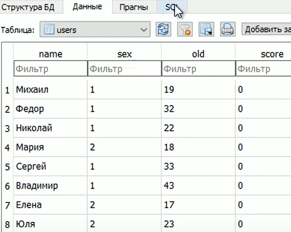
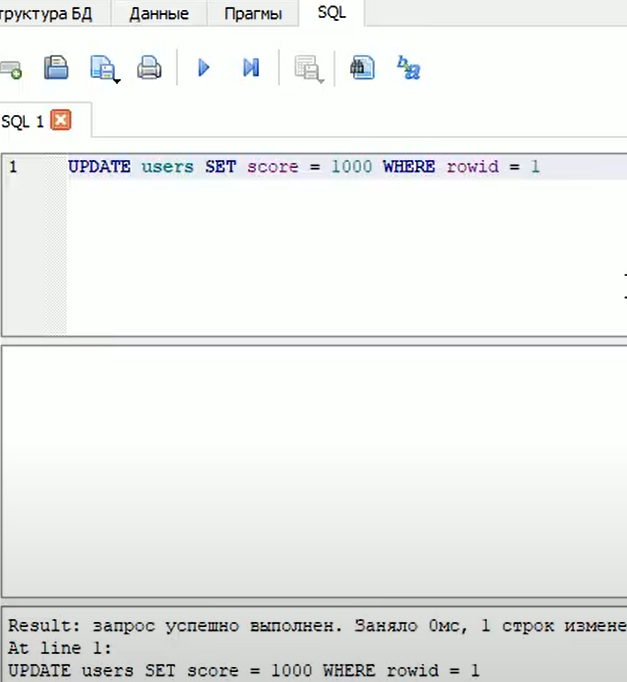
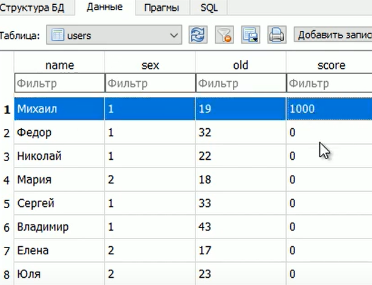
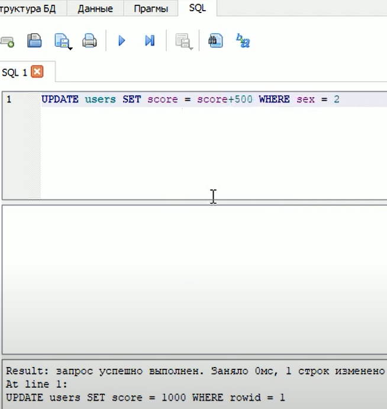
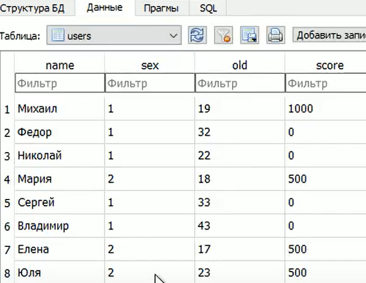
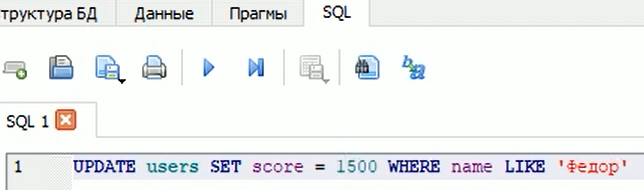
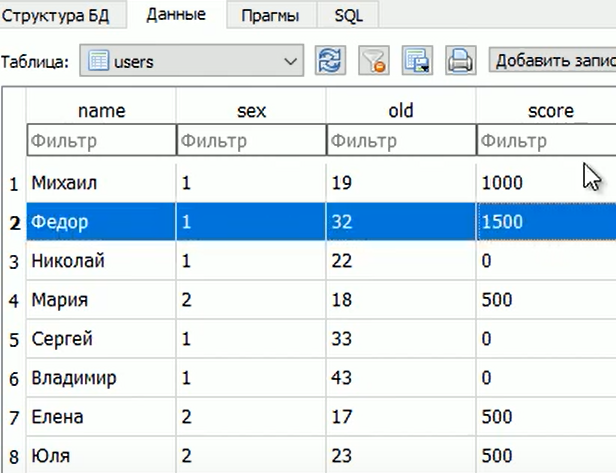

### Lesson #4: команды UPDATE и DELETE при работе с таблицами
Тут поговорим о, изменении(UPDATE) и удалении (DELETE) записей из таблицы

#### Начнем с UPDATE 
Имеет следующий синтаксис:

UPDATE имя_таблицы SET имя_столбца = новое значение WHERE условие

Сделаем для примера обнуление очков в нашей игре сапер

```SQL
UPDATE user SET score = 0
```
WHERE не нужен так как применяем правило ко всем записям таблицы

На практике такой запрос будет крайне редок, так как он применяется 
ко всем записям таблице, а обычно нам нужны жесткие фильтры что-бы
изменить строго определенные записи

Например, изменим количество очков у первого созданного игрока
по полю rowid оно у него будет со значением 1
```SQL
UPDATE user SET score = 100 WHERE rowid = 1
```


Видим, что изменились очки игрока с rowid = 1


Можем сделать так, у всех игроков женского пола то-есть те у кого (sex = 2)
им, количество очков, увеличим на 500
```SQL
UPDATE user SET score = score + 500 WHERE sex = 2
```


И видим что у всех девушек стало на 500 очков больше


Так же есть возможность обратится к игроку по имени, и изменить его
данные по имени, используя оператор LIKE
```SQL
UPDATE user SET score = 1500 WHERE name LIKE "Федор"
```
То есть условие сработает если имя в точности соответствует Федор


И теперь у Федора количество очков 1500


После оператора LIKE мы можем прописывать не только определенную строку,
но и шаблон которому она должна соответствовать
Для шаблона можно использовать:
 - % -означает любое продолжение строки;
 - _ -означает любой символ

Например, запись:
```SQL
UPDATE user SET score = 600 WHERE name LIKE "М%"
```
"М%" - Означает можно взять любое имя начинающееся с (М), 
а все остальные буквы могут быть любыми другими

Еще пример, запись:
```SQL
UPDATE user SET score = 700 WHERE name LIKE "С_рг%"
```
"С_рг%" - Означает что первая буква (С) затем может быть любой символ
затем (рг) и в конце любые символы

На практике лучше не злоупотреблять сравнением строк, это ресурсоемкая
задача, поэтому лучше выполнять сравнение числами и именно по ним проводить
отбор нужных строк для изменения

#### Теперь команда UPDATE 
Эта команда удаляет, нужные нам записи.
Имеет следующий синтаксис:

DELETE FROM имя_таблицы WHERE условие

Тут должны быть очень строгие условия выборки данных, что бы не удалить
что-то нужное.

Часто используют поле rowid для точного нахождения нужной записи
```SQL
DELETE FROM user WHERE rowid IN (1, 17)
```
Тут мы удалим записи c rowid равным 1 и 17

При этом, если нам добавить новые записи в базу данных, эти записи не 
смогут использовать бывшие в употреблении номера rowid. 
Только следующие по порядку и увеличивающиеся на единицу (в нашем случае)
