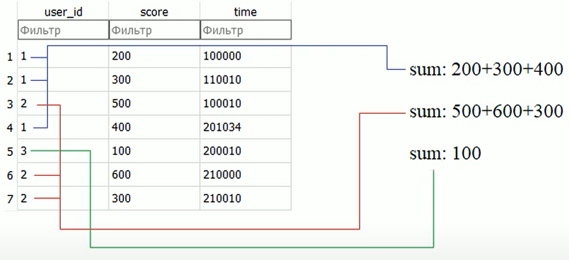

### Lesson #5: агрегирование (агрегатные функции) и группировка GROUP BY

Тут рассмотрим агрегирующие функции используемые в языке SQL
И поговорим о возможности группировки записей по определенному полю.

Все эти операции доступны в операции SELECT.
Для лучшего понимания агрегирующих функций, рассмотрим пример:
Подсчитаем число записей в таблице games, которая приведена, ниже


Записей, которые сыграл первый игрок (user_id == 1).
По самой таблице видим, что таких записей всего три.
Теперь сделаем запрос, который будет вычислять количество нужных записей.

Для начала запишем запрос в таком виде:
```SQL
SELECT user_id FROM games WHERE user_id = 1
```
Тут мы получим искомые нами записи. 


#### Агрегатные функции (SUM(), AVG(), COUNT(), MIN(), MAX())
Нам же, нужно, посчитать количество этих записей. Как раз для этого нам нужны агрегирующие функции.
Как раз одна из них (count) вычисляет число записей которые попали
в нашу выборку
```SQL
SELECT count(user_id) FROM games WHERE user_id = 1
```
Это и есть действие агрегирующей функции, в данном случае функции count


В действительности тут мы можем брать вместо поля user_id и любое другое поле
(например score или time), или даже не указывать его совсем, в данном случае это не важно


Так же можно использовать синоним (alias) с помощью команды AS
этот alias будет использован для отображения в выводе запроса
```SQL
SELECT count(user_id) AS count FROM games WHERE user_id = 1
```


Во всех этих запросах функция count() выполняется в последнюю очередь
В начале происходит выборка данных по запросу, и только после этого, происходит вычисление
агрегирующей функции в нашем случае это функция count()

Вот краткое описание других агрегатных функций:


Теперь решим еще одну задачу, найдем в таблице games количество 
уникальных игроков. Для этих целей используют ключевое слово DISTINCT

Вначале соберем уникальных игроков
```SQL
SELECT DISTINCT user_id AS count FROM games
```


DISTINCT можно использовать в агрегатных функциях:
```SQL
SELECT count(DISTINCT user_id) AS count FROM games
```


Для примера еще посчитаем сумму очков которые заработал первый игрок
Тут как раз важно использовать поле score, так как в нем содержатся заработанные очки игроков
```SQL
SELECT SUM(score) AS "sum" FROM games WHERE user_id = 1
```


Таким образом можно использовать агрегатные функциями.

#### Группировка записей GROUP BY
Представим такую задачу. Мы хотим, для каждого игрока, который у нас есть в нашей таблице games,
посчитать сумму очков. То есть сумма очков не только для одного игрока или всех игроков сразу...
А для каждого игрока в отдельности.

Такую задачу как раз можно решить используя группировку записей в выборке.
Дело в том что агрегирующие функции будут работать в рамках определенной группы.
А сама группа определяется с помощью оператора GROUP BY
GROUP BY <имя_поля>


Если мы сгруппируем пользователей по полю user_id,
то одинаковые значения в поле user_id будут, объединены в группы.
И для каждой этой группы, будет применяться агрегирующая функция.
```SQL
SELECT user_id, SUM(score) AS "scores" FROM games
GROUP BY user_id
```


Тут же можно еще и сортировать записи в нужном нам порядке, 
например по убыванию очков (DESC) или
по возрастанию (ASC)
```SQL
SELECT user_id, SUM(score) AS "scores" FROM games
GROUP BY user_id
ORDER BY scores DESC
```

