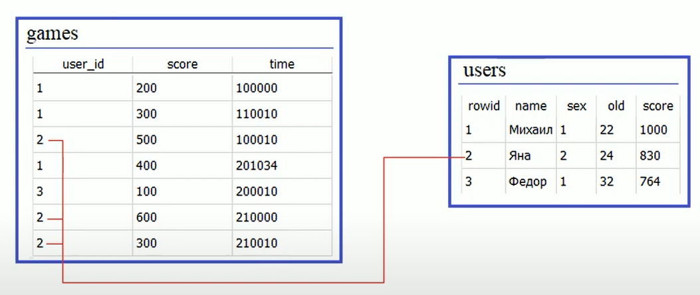
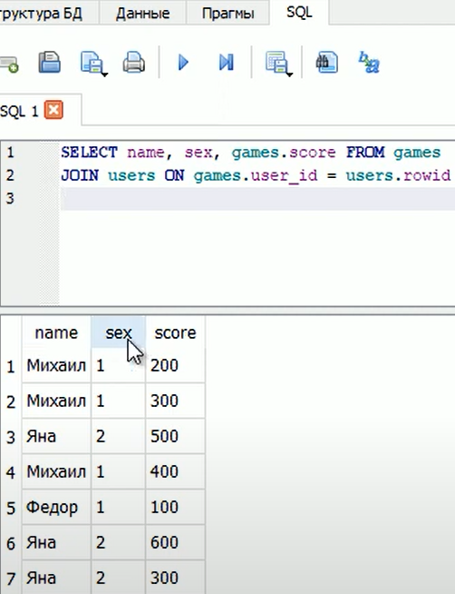
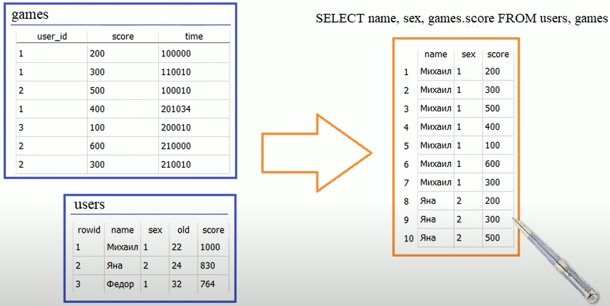
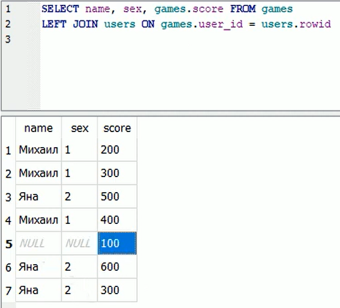
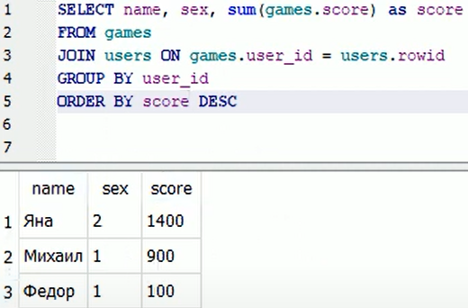
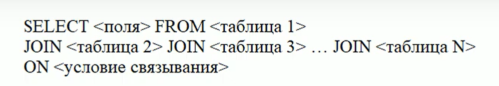

### Lesson #6: оператор JOIN (INNER JOIN), LEFT JOIN для формирования сводного отчета
Пришло время, разобраться как происходит объединение данных из 
разных таблиц, для формирования сводного отчета.

Для этого есть оператор JOIN и его синтаксис такой
JOIN <таблица> ON <условие связывания>

Предположим у нас есть таблица games. В которой храниться список игр
сыгранных определенными игроками.
Еще есть таблицы users нам их можно связать по полю user_id это будет внешний ключ таблицы games


Поле rowid это будет первичный ключ таблицы users

По этим данным мы можем однозначно связать данные двух таблиц,
это как раз делается с помощью оператора JOIN

Предположим нам нужен сводный отчет который бы содержал поля:
 - name из таблицы users
 - sex из таблицы users
 - score из таблицы games

В этом случае запрос может выглядеть следующим образом
```SQL
SELECT name, sex, games.score FROM games
JOIN users ON games.user_id = users.rowid
```
Тут мы к данным таблицы games, присоединяем данные из users
по условию 

games.user_id = user.rowid

Если мы пишем просто JOIN это на самом деле (INNER JOIN)
То-есть объединение данных, если они есть и в первой таблице и во второй таблице.

А такой будет результат:



Следует отметить что можно объединять данные и без оператора JOIN,
просто указав через запятую после FROM вторую таблицы

```SQL
SELECT name, sex, games.score FROM users, games
```
А такой будет результат:


Рассмотрим как она была сформирована, смотрим, сначала берем таблицу users,
и в ней берется первый элемент name со значением "Михаил", sex со значением 1
а значение score со значением 200, берется из таблицы games. А в таблице games у нас семь 
записей, соответственно каждое значение score со значениями 200, 300, 500, 400, 100, 600, 300
подставляются в следующие семь строчек. 

Затем берется второй элемент name таблицы users со значением "Яна", sex со значением 2, 
а значение score со значениями 200, 300, 500, 400, 100, 600, 300, берется из таблицы games 
и подставляются они снова в следующие семь строчек. И так далее если мы объединяем таблицы
через запятую после FROM

Как видим это принципиально отличается от того что мы видели при объединении с помощью 
оператора JOIN

Далее посмотрим как можно иметь все записи из таблицы games а дополнительные данные из таблицы 
users добавлять если они там есть. Для такого объединения данных используется
LEFT JOIN
Попробуем ее использовать
```SQL
SELECT name, sex, games.score FROM games
LEFT JOIN users ON games.user_id = users.rowid
```

А такой будет результат:


Здесь увидим NULL которые говорят о том что была сыграна игра неизвестным пользователем
и он набрал 100 очков

Теперь сформируем ТОП список игроков

```SQL
SELECT name, sex, SUM(games.score) AS "sum" FROM games
JOIN users ON games.user_id = users.rowid
GROUP BY user_id
ORDER BY sum DESC
```
А такой будет результат:


Вот таким образом можно объединять несколько таблиц для формирования сводного отчета.
Причем можно указывать несколько операторов JOIN для объединения данных из сразу 
нескольких таблиц. 
Вот так выглядит в общем случае синтаксис оператора JOIN



