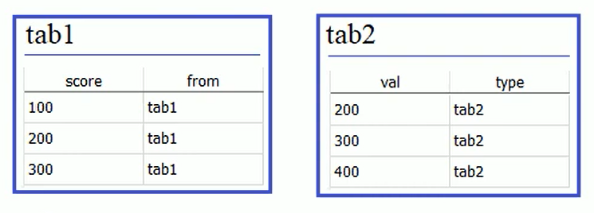
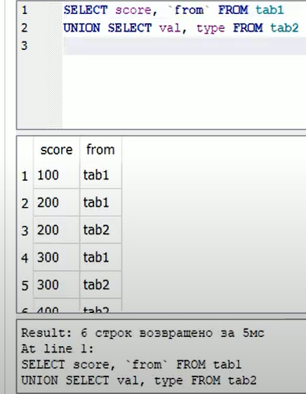
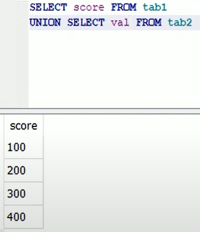
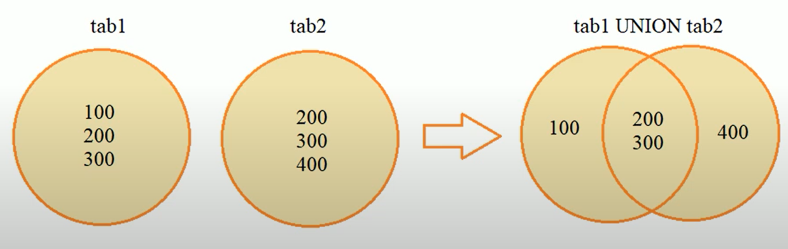
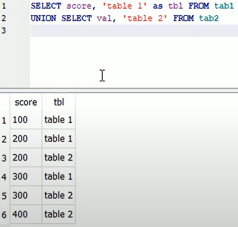
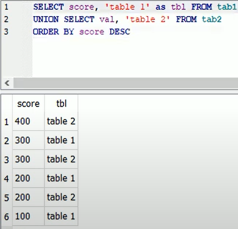

### Lesson #7: оператор UNION объединения нескольких таблиц

Этот оператор объединяет таблицы построчно, например у нас есть две таблицы с одинаковой 
структурой. Все записи этих таблиц можно объединить в один отчет с помощью оператора UNION

Для примера такая структура таблиц tab1, tab2:


Все записи (строки) этих таблиц можно объединить
Теперь выполним такой запрос:
```SQL
SELECT score, "from" FROM tab1
UNION SELECT val, type FROM tab2
```

Или так.

```SQL
SELECT score, `from` FROM tab1
UNION SELECT val, type FROM tab2
```

Важно что бы поля score и val, совпадали по типу данных
и поля from и type также должны совпадать по типу данных
для объединения этих полей

Видим результат объединения tab1, tab2:


То есть, видим у нас объединение происходит так, первым берется строка из таблицы tab1,
в таблице tab2 нет для поля score такого же значения, значит 
вторым шагом берется вторая строка из таблицы tab1,
третьим шагом у нас в таблице tab2 есть в поле val такое же значение 
как в поле score таблицы tab1, а именно значение 200
поэтому берется эта строка при объединении на третьем шаге... и так далее

Теперь посмотрим как будет выглядеть объединенье только по полям score и val

Видим такой результат:



Видим что получилось всего четыре строчки, дело в том что, оператор
UNION при объединении данных, оставляет только уникальные записи
(записи с уникальными значениями)

Вот наглядно:



Точно такая же ситуация будет и при использовании нескольких полей, если там будут 
повторяющиеся значения, то будут оставлены, только уникальные строки

Есть еще один вариант объединения записей, мы можем указать так 

```SQL
SELECT score, 'tabel 1' AS tb1 FROM tab1
UNION SELECT val, 'tabel 2' FROM tab2
```

Выполнив такой запрос увидим:



Можно так же сортировать, по любому полю, например по очкам score
в порядке убывания для примера.

```SQL
SELECT score, 'tabel 1' AS tb1 FROM tab1
UNION SELECT val, 'tabel 2' FROM tab2
ORDER BY score DESC
```

Выполнив такой запрос увидим:



Вот так можно делать объединения строк в таблицах на языке SQL
