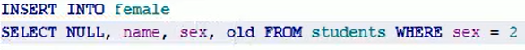

### Lesson #8: Вложенные SQL - запросы

Тут поговорим о возможности создавать вложенные запросы.
Лучше всего вложенные запросы понять на примере.

У нас будет две таблицы

Таблица students (студенты)
со списком студентов 


Таблица marks (отметки)
содержит оценки по разным предметам (subject)


Допустим у нас есть задача, выбрать учеников у которых оценка по языку "Си",
выше, чем оценка по этому же предмету, у ученика Маши

В таблице students мы видим что Маша это студент с полем id равным 2.
Значит, нам нужно брать строчку в таблице marks c полем id равным 2,
и поле subject (предмет) в этой таблице, должно быть "Си" (интересуемый нас предмет).
Видим что оценка Маши по предмету Си равна 3. 
Соответственно нам нужны студенты у которых оценка по предмету Си выше оценки в 3.

Видим что это у нас студенты с id равным 1 и 3 

Теперь посмотрим как решить такую задачу используя SQL.
Для решения нам нужно реализовать два запроса, 
При первом, мы определим какую оценку получила Маша по языку Си.
И в следующем шаге составим запрос для всех студентов у которых оценка 
по языку Си выше чем найденная в первом запросе у Маши.

Первый запрос можно записать так:

```SQL
SELECT mark FROM marks
WHERE id = 2 AND subject LIKE 'Си'
```

Тут мы находим оценку Маши по языку Си, если выполним увидим 3


Теперь мы можем выполнить следующий запрос выбрав студентов у которых оценка
по Си выше чем 3 (оценка Маши)

```SQL
SELECT name, subject, mark FROM marks
JOIN students ON students.id = marks.id
WHERE mark > 3 AND subject LIKE 'Си'
```
Тут мы в условии пишем "mark > 3" так как мы оценку уже узнали
и можем так поступить.

Если выполнить запрос увидим что есть два ученика "Коля" и "Вася"
у которых по "Си" оценка выше чем у Маши"


Вот так используя два запроса мы можем решить эту задачу.
Так вот, в языке SQL эти два запроса можно объединить в один,
используя идею вложенных запросов.

Вложенным запросом можно сделать так:

```SQL
SELECT name, subject, mark FROM marks
JOIN students ON students.id = marks.id
WHERE mark > ( SELECT mark FROM marks
WHERE id = 2 AND subject LIKE 'Си' ) 
AND subject LIKE 'Си'
```

Вначале будет выполнен запрос в () это и есть вложенный запрос (определение оценки "Маши").
И потом выполнится внешний запрос и определятся все студенты у которых оценка выше чем
у "Маши".

Теперь посмотрим как быть если вложенный запрос вернет несколько значений
Например, уберем условие единственного интересуемого предмета, пусть будут все оценки маши
по всем предметам

```SQL
SELECT name, subject, mark FROM marks
JOIN students ON students.id = marks.id
WHERE mark > ( SELECT mark FROM marks
WHERE id = 2 ) 
AND subject LIKE 'Си'
```

Если записаны просто скобки () то, берется из выборки, только первое значение.
1) Во вложенных запросах также можно использовать и агрегирующие функции.

Например, найдем среднее арифметическое оценок "Маши"

```SQL
SELECT name, subject, mark FROM marks
JOIN students ON students.id = marks.id
WHERE mark > ( SELECT avg(mark) FROM marks
WHERE id = 2 ) 
AND subject LIKE 'Си'
```

2) Еще можно использовать INSERT (добавлять данные в таблицу).

Предположим у нас есть таблица female (женский)


Она идентична таблице students со списком студентов, только предполагает отбор женщин.
И соответственно задача добавить в таблицу female всех студентов с sex (полом) 2 (женским)
Посмотрим данные которые мы получим 


Теперь что бы вставить эти полученные строчки в таблицу можно выполнить такой запрос


После выполнения этого запроса увидим в таблице female следующие данные


Но в такой записи есть недостаток, если его еще раз выполнить будет ошибка, так как,
данные в поле id (главный ключ (primary kay)) не будут уникальными ведь они уже добавлялись.
Так как эти данные будут определяться автоматически мы можем этот запрос переписать так.



Выполнив запрос видим в таблице female следующие данные


Такой запрос получился более универсальным.

3) Так же, похожим образом и для UPDATE (изменение имеющихся данных),
Например обнулим все оценки которые меньше или равны минимальной оценки студента с id = 1

Код запросы


Данные в таблице marks


4) Аналогично для DELETE (удалять определенные записи)
Например, требуется удалить из таблицы students всех студентов возраст у которых
меньше чем у "Машы" (возраст "Машы" у нас 18 лет поэтому нужно удалить "Дашу" и "Колю") 

Код запросы


Данные в таблице students


Вот таким образом создаются вложенные запросы в языке SQL, однако пользоваться ими
лучше в последнюю очередь, только если другими способами не решить задачу, так как
вложенные запросы создают свое отдельное обращение к базе данных на что тратятся 
дополнительные ресурсы.

