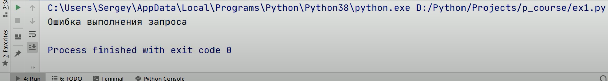
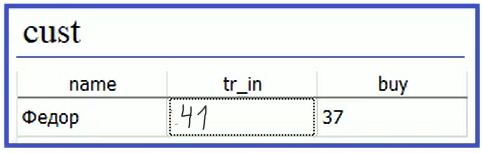
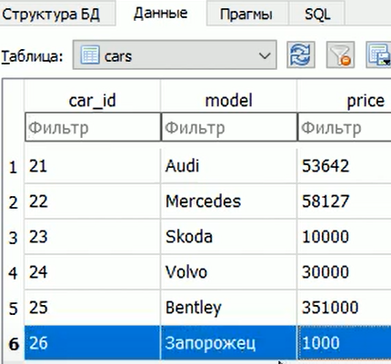
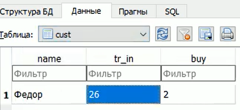

### Lesson #9: методы execute, executemany, executescript, commit, rollback и свойство lastrowid
До этого мы рассмотрели основы языка SQL. 
Теперь поговорим о методах пакета sqlite3 то-есть о API этой СУБД.

Некоторые моменты мы уже смотрели, для базовой работы с базой данных, можно
использовать менеджер контекста with то-есть связываться с базой данных
с помощью with

```python
import sqlite3 as sq

with sq.connect("cars.db") as con:
    cur = con.cursor()

    cur.execute("""CREATE TABLE IF NOT EXIST cars(
                    car_id INTEGER PRIMARY KEY AUTOINCREMENT,
                    model TEXT,
                    price INTEGER
    )""")

#con.commit()
#con.close()
```
Тут уже через курсор (cur) мы выполняем определенные команды SQL запросов

Когда менеджер контекста, завершает свою работу, то автоматически выполняются
con.commit() - этот метод сохраняет все изменения в базу данных 
con.close() - этот метод закрывает соединение с базой данных

Посмотрим теперь каким образом происходит работа с базой данных, 
во-первых, команда execute() выполняет определенный SQL запрос

Продолжим предыдущий код и добавим в нашу базу данных значения 

```python
import sqlite3 as sq

with sq.connect("cars.db") as con:
    cur = con.cursor()

    cur.execute("""CREATE TABLE IF NOT EXISTS cars(
                    car_id INTEGER PRIMARY KEY AUTOINCREMENT,
                    model TEXT,
                    price INTEGER
    )""")
    
    cur.execute("INSERT INTO cars VALUES(1, 'Audi', '52642')")
    cur.execute("INSERT INTO cars VALUES(2, 'Mercedes', '57127')")
    cur.execute("INSERT INTO cars VALUES(3, 'Skoda', '9000')")
    cur.execute("INSERT INTO cars VALUES(4, 'Volvo', '29000')")
    cur.execute("INSERT INTO cars VALUES(5, 'Bentley', '350000')")
```

После выполнения кода увидим базу с именем cars.db и со следующим содержимым
в виде пяти строчек (записей)


Когда мы программируем на Python, такие данные, как правило, хранятся в коллекциях
Например в начале нашей программы объявим коллекцию с именем cars

И далее мы хотим брать значения из этого списка (нашей коллекции), и передавать их 
в наш SQL запрос. Для этого можно делать запись с шаблоном вместо сырого SQL

```python
import sqlite3 as sq

cars = [
    ('Audi', 52642),
    ('Mercedes', 57127),
    ('Skoda', 9000),
    ('Volvo', 29000),
    ('Bentley', 350000),
]

with sq.connect("cars.db") as con:
    cur = con.cursor()

    cur.execute("""CREATE TABLE IF NOT EXISTS cars(
                    car_id INTEGER PRIMARY KEY AUTOINCREMENT,
                    model TEXT,
                    price INTEGER
    )""")
    
    for car in cars:
        cur.execute("INSERT INTO cars VALUES(NULL, ?, ?)", car)
```
Если этот код выполним в нашей базе cars.db увидим еще пять строчек (записей)


Или, еще вариант, можно поступить еще проще, можно воспользоваться методом 
executemany() - который, автоматически перебирает всю коллекцию и подставляет вместо (?)
соответствующие значения из коллекции

```python
import sqlite3 as sq

cars = [
    ('Audi', 52642),
    ('Mercedes', 57127),
    ('Skoda', 9000),
    ('Volvo', 29000),
    ('Bentley', 350000),
]

with sq.connect("cars.db") as con:
    cur = con.cursor()

    cur.execute("""CREATE TABLE IF NOT EXISTS cars(
                    car_id INTEGER PRIMARY KEY AUTOINCREMENT,
                    model TEXT,
                    price INTEGER
    )""")

    cur.executemany("INSERT INTO cars VALUES(NULL, ?, ?)", cars)
```
Если этот код выполним в нашей базе cars.db увидим еще пять строчек (записей)


Помимо знаков (?) в шаблонах можно использовать и именованные параметры, для этого
записывают в таком виде.

```python
import sqlite3 as sq

with sq.connect("cars.db") as con:
    cur = con.cursor()

    cur.execute("""CREATE TABLE IF NOT EXISTS cars(
                    car_id INTEGER PRIMARY KEY AUTOINCREMENT,
                    model TEXT,
                    price INTEGER
    )""")

    cur.execute("UPDATE cars SET price = :Price WHERE model LIKE 'A%'", {'Price': 0})
```
Здесь методу в шаблоне методе execute()

:Price - именованный параметр пишется после (:) 
и тогда при таком синтаксисе вторым аргументов методу executemany() мы передадим словарь
в этом словаре будет как раз ключ (Price) и его значение подставится 

В этом примере мы подставим всем моделям (model) начинающимся с буквы (A) установим
цену (price) равной (0)


Вот таким образом можно использовать или, именованные параметры, или неименованные 
(которые подставляются просто по индексу коллекции)

Если нам нужно выполнить сразу несколько SQL команд, можно воспользоваться 
методом executescript(), которому через (;) можно передать несколько нужных команд SQL

Например, выполним две команды
1) удаляет из таблицы cars все марки моделей машин начинающимся с буквы (A)
2) для всех оставшихся машин увеличивает цену на тысячу (1000)

```python
import sqlite3 as sq

with sq.connect("cars.db") as con:
    cur = con.cursor()

    cur.execute("""CREATE TABLE IF NOT EXISTS cars(
                    car_id INTEGER PRIMARY KEY AUTOINCREMENT,
                    model TEXT,
                    price INTEGER
    )""")

    cur.executescript("""DELETE FROM cars WHERE model LIKE 'A%'; 
                         UPDATE cars SET price = price + 1000
                      """)
```
После выполнения увидим результат


У этого метода (executescript()) есть ограничение в нем нельзя использовать шаблоны запросов как мы это делали
в предыдущих методах execute(), executemany().
Метод executescript() - буквально записывает запросы как они есть, со всеми данными.

Далее, для примера, реализуем подключение к базе данных через блок обработки исключений
try, except, finally
```python
import sqlite3 as sq

con = None
try:
    con = sq.connect("cars.db")
    cur = con.cursor()

    cur.execute("""CREATE TABLE IF NOT EXISTS cars (
                         car_id INTEGER PRIMARY KEY AUTOINCREMENT,
                         model TEXT,
                         price INTEGER
                        );
               BEGIN;
               INSERT INTO cars VALUES(NULL, 'Audi', '52642');
               INSERT INTO cars VALUES(NULL, 'Mercedes', '57127');
               INSERT INTO cars VALUES(NULL, 'Skoda', '9000');
               INSERT INTO cars VALUES(NULL, 'Volvo', '29000');
               INSERT INTO cars VALUES(NULL, 'Bentley', '350000');
               UPDATE cars SET price = price + 1000
               """)
    con.commit()
except sq.Error as e:
    if con: 
        con.rollback()
        print("Ошибка выполнения запроса")
finally:
    if con:
        con.close()
```
Блок except будет отлавливать специальное исключение sq.Error
и в консоль будет выводить сообщение "Ошибка выполнения запроса"

В блоке finally проверяем установленно ли соединение с базой данных, если оно установленно,
то его нужно закрыть, а этот блок выполнится в любом случае, даже если в блоке try
произошли ошибки, соответственно эти строки гарантируют закрытие соединения с базой
Метод close() закрывает соединение с базой данных

Метод commit() сохраняет в базу данных все изменения которые сделаны. Его вызываем в блоке try
Метод con.rollback() откатывает состояние базы данных в исходное состояние и все изменения
применены не будут.

BEGIN;
служит меткой к которой мы откатимся если возникнет rollback()

Преимуществом такого подхода является то что мы в ручную вызываем методы commit(), close(),
rollback()
Увидим после выполнения кода:


Для дальнейшего примера удалим все значения в базе данных у нас таблица (cars)
будет пустой без значений.
Теперь допустим в коде ошибку, для примера напишем для одной из sql команд неправильное 
имя таблице вместо cars напишем cars2

```python
import sqlite3 as sq

con = None
try:

    con = sq.connect("cars.db")
    cur = con.cursor()

    cur.execute("""CREATE TABLE IF NOT EXISTS cars (
                         car_id INTEGER PRIMARY KEY AUTOINCREMENT,
                         model TEXT,
                         price INTEGER
                        );
               BEGIN;
               INSERT INTO cars VALUES(NULL, 'Audi', '52642');
               INSERT INTO cars VALUES(NULL, 'Mercedes', '57127');
               INSERT INTO cars VALUES(NULL, 'Skoda', '9000');
               INSERT INTO cars VALUES(NULL, 'Volvo', '29000');
               INSERT INTO cars VALUES(NULL, 'Bentley', '350000');
               UPDATE cars2 SET price = price + 1000
               """)
    con.commit()
except sq.Error as e:
    if con: 
        con.rollback()
        print("Ошибка выполнения запроса")
finally:
    if con:
        con.close()
```

То есть тут у нас должна произойти ошибка в коде

`UPDATE cars2 SET price = price + 1000`

И соответственно, состояние базы данных должно откатится к исходному состоянию
должны остаться строки пустыми
Также мы увидим в консоли строку "Ошибка выполнения запроса"



И соответственно у нас, по прежнему нет ни одной записи в таблице cars

Если же, исправить ошибку 
```python
import sqlite3 as sq

con = None
try:

    con = sq.connect("cars.db")
    cur = con.cursor()

    cur.execute("""CREATE TABLE IF NOT EXISTS cars (
                         car_id INTEGER PRIMARY KEY AUTOINCREMENT,
                         model TEXT,
                         price INTEGER
                        );
               BEGIN;
               INSERT INTO cars VALUES(NULL, 'Audi', '52642');
               INSERT INTO cars VALUES(NULL, 'Mercedes', '57127');
               INSERT INTO cars VALUES(NULL, 'Skoda', '9000');
               INSERT INTO cars VALUES(NULL, 'Volvo', '29000');
               INSERT INTO cars VALUES(NULL, 'Bentley', '350000');
               UPDATE cars SET price = price + 1000
               """)
    con.commit()
except sq.Error as e:
    if con: 
        con.rollback()
        print("Ошибка выполнения запроса")
finally:
    if con:
        con.close()
```
То увидим в базе данных все наши изменения, то есть новые записи.


Теперь представим что у нас помимо таблицы cars есть еще таблица (cust).
Она содержит покупателей машин, причем, если покупка происходит по 'трейдин' (tr_in)
то прежняя машина владельца добавляется в конец списка таблицы cars,
а в поле tr_in таблицы cust появляется (id) этой машины которая была сдана по 'трейдин'.
Причем значение этого (id) вычисляется как последнее вводимое в таблицу cars.
А поле (buy) таблицы cust будет содержать (id) машины, которую приобрел покупатель

таблица cars.


таблица cust.



Посмотрим как реализовать теперь запрос для добавления информации в таблицу cast.
Для этого нам нужно знать id автомобиля который будет сдан по 'трейдин' и по договоренности,
эта машина добавляется последней в таблицу cars. 

Предположим что 'Федор' еще не совершил покупку, а значит таблица cars не содержит записи с его сданным
автомобилем. Поэтому, для начала, мы ее добавим.
Воспользуемся менеджером контекста with

```python
import sqlite3 as sq

with sq.connect("cars.db") as con:
    cur = con.cursor()

    cur.executescript("""CREATE TABLE IF NOT EXISTS cars(
                    car_id INTEGER PRIMARY KEY AUTOINCREMENT,
                    model TEXT,
                    price INTEGER
                );
                
                CREATE TABLE IF NOT EXISTS cust (
                name TEXT,
                tr_in INTEGER,
                buy INTEGER
                );
    """)

    cur.execute("INSERT INTO cars VALUES(NULL, 'Запорожец', 1000)")
    last_row_id = cur.lastrowid
    buy_car_id = 2
    cur.execute("INSERT INTO cust VALUES('Федор', ?, ?)", (last_row_id, buy_car_id))
```

Таблица cust будет содержать поля
name - имя покупателя
tr_in - машина с данными по 'трейдин'
buy - id купленной машины

Когда будет выполнен запрос
`cur.execute("INSERT INTO cars VALUES(NULL, 'Запорожец', 1000)")`
а за ним метод (lastrowid)
`last_row_id = cur.lastrowid`
будет содержать id последней добавленной записи "INSERT INTO cars VALUES(NULL, 'Запорожец', 1000)"

И мы сможем воспользоваться этой информацией, сформировав второй запрос, уже в таблицу cust

`buy_car_id = 2`

`cur.execute("INSERT INTO cust VALUES('Федор', ?, ?)", (last_row_id, buy_car_id))`

После выполнения кода будем видеть такие результаты.

Таблица cars



Таблица cust



Такой прием часто используют что бы запомнить id последней добавленной через execute() записи в таблицу
базы данных, и затем этот номер добавить в содержимое другой таблицы.
